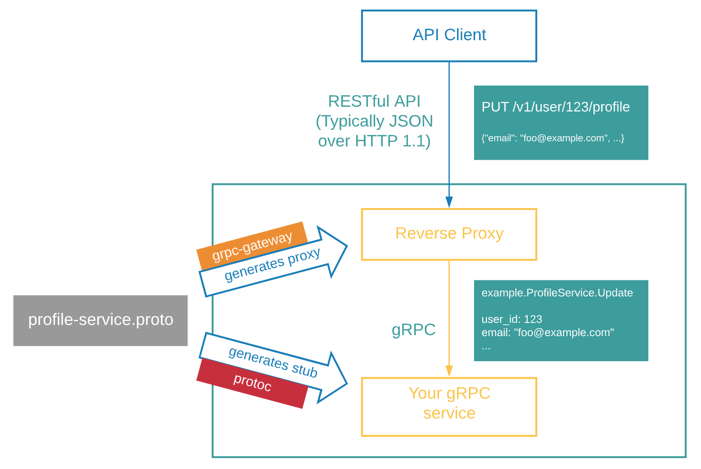

在某些情况下，即使我们写了 gRPc 服务，但我们仍然想提供传统的 HTTP/JSON API。但是仅仅为了公开 HTTP/JSON API 而编写另一个服务有点不友好。
有什么方法可以只编写一次代码，却可以同时在 gRPC 和 HTTP/JSON 中提供 API？ 

gRPC-gateway 可以帮我们做到，它读取 protobuf service 定义并生成反向代理服务器( reverse-proxy server) ，根据服务定义中的 `google.api.http annotations` 将 RESTful HTTP API 转换为 gRPC。




### 借助 [buf](https://github.com/bufbuild/buf) 友好生成 protobuf 所需代码

** 安装 buf

```
BIN="/usr/local/bin" && \
VERSION="1.0.0-rc2" && \
BINARY_NAME="buf" && \
curl -sSL \
     "https://github.com/bufbuild/buf/releases/download/v${VERSION}/${BINARY_NAME}-$(uname -s)-$(uname -m)" \
     -o "${BIN}/${BINARY_NAME}" && \
chmod +x "${BIN}/${BINARY_NAME}"
```

执行 `buf generate` 之后就生成了。

### 使用
```
make all
curl localhost:9090/hello?message=world
```
